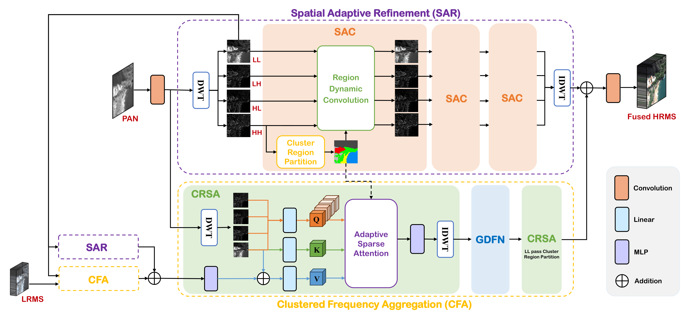
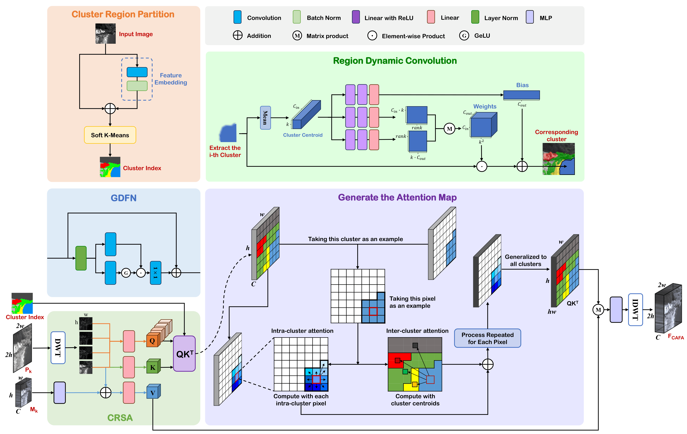

# Region-Aware Fusion (RAF) Network for Pansharpening 

  

 

  <strong>Abstract:</strong> 
  Pansharpening aims to integrate a high-resolution panchromatic (PAN) image with a low-resolution multispectral (LRMS) image to generate a high-resolution multispectral (HRMS) image. To overcome the inherent limitations of existing architectures in spatial detail enhancement and frequency-domain fusion, we propose a novel Region-Aware Fusion (RAF) network. Specifically, we design a Spatial Adaptive Refinement (SAR) module that seamlessly integrates discrete wavelet transforms with K-means semantic clustering to explicitly accommodate frequency variations. Furthermore, we introduce a Cluster-Routed Sparse Attention (CRSA) module that leverages semantic clustering priors to adaptively route the flow of frequency information across distinct regions. By synergizing spatial adaptability with frequency-domain reconstruction, our method drastically mitigates computational complexity while guaranteeing high-fidelity detail propagation. Extensive experiments demonstrate that our network establishes a new state-of-the-art performance and exhibits exceptional generalizability across diverse real-world remote sensing scenarios.

## News

- **2026/04/03:** Code Presented! :fire: 
- **2025/01/20:** Repository Created! :tada:

## Quick Review

## Instructions

### Code Structure

- **`caac.py`**: The core implementation of our Region-Aware Fusion (RAF) network architecture. It includes the Differentiable Soft K-Means clustering, the Low-Rank Adaptive Convolution (PWAC), and the Adaptive Attention mechanisms.
- **`train_caac_distributed.py`**: A robust multi-GPU training script supporting `DataParallel`. It includes comprehensive features such as automatic learning rate decay, validation loss tracking, and breakpoint resuming for interrupted training sessions.
- **`super_para.yml`**: The configuration file containing essential hyperparameters for the network, including max learning rate (`lr_max`), batch size, target channel dimensions, and dropout rates.
- **`download.py`**: A convenient utility script designed to quickly download the required remote sensing datasets directly from the cloud storage.

### Dataset

In this repository, we evaluate our method using the WV3 and GF-2 datasets. Since we utilize the excellent open-source datasets provided by the community, please refer to the [liangjiandeng/PanCollection](https://github.com/liangjiandeng/PanCollection) repository for data preparation. 

### Convenient Access to Results and Support for Beginners
The creator of this repository is also the co-first author of this paper. This work represents the author's academic efforts and dedication in the fields of pansharpening and deep learning, embodying a great deal of hard work aimed at a successful submission.
Furthermore, if researchers in the pansharpening field wish to use this paper as a baseline for comparison, please feel free to directly contact the first author to obtain the weight files and gain a deeper understanding of this work.
📫 Contact Email: 2518720025@stu.xjtu.edu.cn
The author would be deeply honored to communicate and exchange ideas with fellow scholars in the pansharpening community.

The weight files and evaluation metrics of the network architecture will be provided later.

